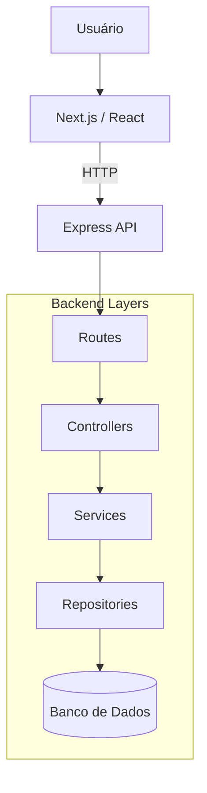

# Análise da Arquitetura

Após uma análise detalhada da estrutura do projeto, concluímos que a arquitetura adota o padrão **Cliente-Servidor** e é organizada em um modelo de **camadas**. Essa abordagem promove uma clara separação de responsabilidades, resultando em um sistema mais organizado, escalável e de fácil manutenção.

A aplicação é dividida em duas partes principais:

  - **Frontend (Cliente):** Desenvolvido com **Next.js/React**, é a camada de apresentação responsável por toda a interação com o usuário. Suas principais atribuições incluem a renderização da interface, a gestão do estado da UI (gerenciamento de componentes, rotas, etc.) e o tratamento de eventos de entrada do usuário. É a partir daqui que as requisições para o backend são originadas.

  - **Backend (Servidor):** Construído como uma **API com Express.js**, esta camada é o núcleo do sistema. Ela concentra a lógica de negócio, as regras da aplicação e o acesso aos dados, funcionando de forma independente da interface do usuário. A organização interna do backend segue um fluxo bem definido de responsabilidades:

      - **Rotas (Routes):** A porta de entrada da API. Mapeiam os endpoints HTTP (ex: `/users`, `/pets`) para os controladores correspondentes.
      - **Controladores (Controllers):** Recebem as requisições das rotas, validam os dados de entrada (corpo, parâmetros) e orquestram o fluxo, invocando os serviços apropriados para executar a lógica de negócio.
      - **Serviços (Services):** Contêm a lógica de negócio principal. É aqui que as regras e os processos da aplicação são executados. Eles são agnósticos em relação ao protocolo HTTP e interagem com a camada de repositórios para manipular os dados.
      - **Repositórios (Repositories):** Camada de abstração para o acesso a dados. É a única parte do sistema que se comunica diretamente com o banco de dados, isolando o restante da aplicação dos detalhes de implementação da fonte de dados (SQL, NoSQL, etc.).

### Comunicação

A comunicação entre o Frontend e o Backend é realizada por meio de uma **API RESTful**. O cliente dispara requisições **HTTP** (GET, POST, PUT, DELETE) para os endpoints expostos pelo servidor, enviando e recebendo dados no formato **JSON**. Esse desacoplamento permite que ambas as partes evoluam de forma independente, facilitando o desenvolvimento, os testes e a escalabilidade de cada camada.

## Diagrama de Pacotes

